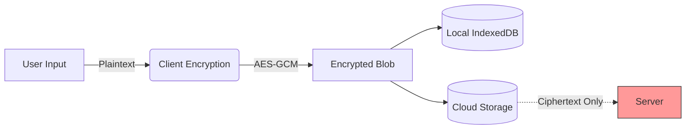
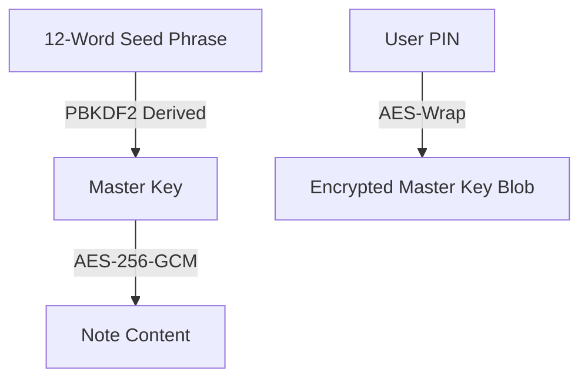

# Kakograph

> ⚠️ **Warning**: This application is built specifically to serve my own niche needs and is **heavily "vibe coded" by AI**. Use at your own risk.

> **Write first, organize later** — Zero-knowledge, local-first note-taking.

Kakograph is a privacy-focused note-taking PWA designed for speed, security, and user sovereignty. All data is encrypted client-side using AES-256-GCM, and authentication is handled via a BIP-39 seed phrase, removing the need for email or password logins.

---

## Features

### Core
- **Zero-Knowledge Architecture** — Your notes are encrypted before they ever leave your device.
- **Block-Based Editor** — A Notion-style editing experience built with **BlockNote**.
- **Mobile-First PWA** — Fully responsive and installable on iOS and Android.
- **Offline-First** — Operates 100% offline using IndexedDB, syncing only when connection is available.
- **Completely Free** — No subscriptions, no hidden cloud costs.

### Editor
- **Slash Commands** — Simply type `/` to access headings, lists, tables, code blocks, and more.
- **Wiki-style Linking** — Connect your thoughts using `[[Note Title]]` with built-in autocomplete.
- **Rich Media** — Support for images, code blocks (20+ languages), and data tables.
- **Markdown Shortcuts** — Use standard markdown syntax `#`, `-`, `[]`, `>` for rapid formatting.

### Organization
- **Virtual Folders** — Organize via drag-and-drop.
- **Trash Bin** — Soft delete system with a 30-day auto-cleanup policy (visible expiration date).
- **Granular Recovery** — Restore or permanently delete individual notes or entire folders.
- **Interactive Graph** — Visualize the connections between your notes.

### Security & Export
- **Session PIN Lock** — Quickly unlock your session without re-entering your seed phrase.
- **Full Snapshot Backup** — Export your entire database (notes, trash, folders) as a single JSON file.
- **Seed Phrase Recovery** — Reset your PIN anytime using your 12-word recovery phrase.

---

## Quick Start

```bash
# Install dependencies
npm install

# Run development server
npm run dev
# Open http://localhost:3000
```

---

## Docker Deployment (Frontend)

To run the application containerized:

```bash
# Build the image
docker build -t kakograph .

# Run the container
docker run -p 3000:3000 kakograph
```

The application will be accessible at `http://localhost:3000`.

---

## Deployment & Identity

Kakograph is built on the principle of **User Sovereignty**. You have full control over where your data lives.

### Scenario A: "Bring Your Own Database"
**Use Case:** You want to use the official application interface but prefer your data to be stored on your own private server.

1. **Host the Backend**:
   Run the open-source Convex backend on your machine or VPS:
   ```bash
   docker run -d -p 3210:3210 convexinc/convex-backend:latest
   ```
2. **Configure the App**:
   - Navigate to **Settings** → **Sync Settings** in the app.
   - Select **"Custom URL"**.
   - Input your server address: `http://localhost:3210` (or your VPS IP).

**Result:** You use the official interface, but your encrypted data syncs directly to your private server. The application host has no access to your information.

### Scenario B: "Full Self-Hosting"
**Use Case:** You prefer to host the entire stack (App + Database) independently.

We provide a `docker-compose.yml` configuration to launch the full stack with a single command:

```bash
# Start both App and Backend
docker-compose up -d --build
```

- **App**: `http://localhost:3000`
- **Backend**: `http://localhost:3210`

This configuration ensures complete isolation from external networks.

---

## Tech Stack

| Layer | Technology |
|-------|------------|
| **Framework** | Next.js 16 (App Router, Turbopack) |
| **Language** | TypeScript |
| **Editor** | **BlockNote** (React-based, Prosemirror-powered) |
| **Storage** | IndexedDB via Dexie.js |
| **Graph** | react-force-graph-2d (D3-based) |
| **Crypto** | WebCrypto API (AES-256-GCM, PBKDF2) |
| **Identity** | BIP-39 seed phrase |
| **Styling** | Tailwind CSS + Custom CSS |
| **Icons** | Lucide React |

---

## Security & Privacy Architecture

Kakograph is a **Zero-Knowledge** application. The backend is blind to your data, it stores only encrypted blobs.

### Data Flow



> **In plain English:** Your device encrypts everything *before* saving. The server only receives scrambled data blobs that look like random noise. We literally cannot read your notes.

### Encryption Specifications

| Component | Specification | Details |
|-----------|---------------|---------|
| **Algorithm** | [`AES-256-GCM`](https://nvlpubs.nist.gov/nistpubs/Legacy/SP/nistspecialpublication800-38d.pdf) | Authenticated encryption (Galois/Counter Mode) |
| **Key Size** | 256-bit | High-security standard |
| **IV Scope** | 96-bit Unique | Generated randomly per individual note |
| **Key Derivation** | [`PBKDF2-SHA256`](https://tools.ietf.org/html/rfc2898) | 100,000 iterations for brute-force resistance |
| **Identity** | [`BIP-39`](https://github.com/bitcoin/bips/blob/master/bip-0039.mediawiki) | 12-word mnemonic (Standard crypto wallet format) |

> **Why this matters:** We don't invent our own crypto. We use **proven, industry-standard algorithms** trusted by banks and governments to ensure your data is mathematically secure.

### Key Management Lifecycle

Your Master Key is derived deterministically from your seed phrase. It never leaves the client memory in plaintext.



> **How it works:** You don't need to type your 12 words every time. You set a simple PIN to "wrap" your keys safely on your device. This gives you convenience without sacrificing the deep security of the underlying cryptography.

### Critical Security Properties
1.  **Client-Side Only**: All encryption happens in your browser via the [**WebCrypto API**](https://www.w3.org/TR/WebCryptoAPI/). The "keys" to your data never leave your device.
2.  **Session Security**: The PIN mechanism encrypts your Master Key locally. Even if someone steals your computer's files, they cannot decrypt your data without your PIN.
3.  **No Backdoors**: There is no password reset. If you lose your seed phrase, your data is mathematically unrecoverable. This ensures *no one* (not even us) can ever impersonate you.

### 🧠 Security Deep Dive

#### How can 12 simple words be secure?
It seems counterintuitive that 12 dictionary words are unhackable, but it comes down to pure mathematics.
*   The BIP-39 wordlist has **2,048 words**.
*   Selecting 12 words provides **$2048^{12}$** possible combinations.
*   That is **$5.4 \times 10^{39}$** possibilities (or $2^{128}$).

> **In plain English:** To guess your phrase, a hacker would have to iterate through more possibilities than there are **atoms in the observable universe**. Even with all the supercomputers in the world, it would take billions of years.

#### Does the server know my phrase?
**No.** The server does not store any list of "valid" or "existing" accounts.
*   **Validation is Local**: When you type your phrase, the app checks the **checksum** (the mathematical relationship between the words) locally on your device.
*   **No Registration**: There is no "database of users". Your "account" is just a mathematical location in the encrypted cloud storage. If you have the key, you can access the data at that location.

> **Why this matters:** There is no central "honey pot" of user passwords for hackers to steal. Since we don't store your identity, we can't lose it.

#### How do devices sync without an email/login?
Since there is no "account" in the traditional sense, we use deterministic cryptography to connect your devices:
1.  **Seed ID Derivation**: Your device takes your 12 words and cryptographically hashes them (using PBKDF2) to generate a unique public string, which we call the **Seed ID**.
2.  **Shared "Topic"**: This Seed ID functions as a unique **Topic ID** on the database. It is simply a long string of random-looking characters (e.g., `8f7d...2a1`).
3.  **Subscription**: When a device connects, it asks the server: *"Give me all data labeled with this Topic ID."* Since the server doesn't know the 12 words (only the derived public hash), it simply acts as a dumb relay for that specific Topic.

> **In plain English:** Imagine your 12 words generate two things: a **Map** and a **Key**.
> *   The **Map** tells the app *where* to store the box (the Server/Topic ID).
> *   The **Key** locks the box *before* it's sent.
> *   The Server only sees the locked box at the location. It has the Map, but **it never sees the Key**. Even if someone stole the Map and found your box, they couldn't open it.

#### Is the exported backup file secure?
**Yes.** The export feature produces a raw dump of the **encrypted** database.
*   **Same Encryption**: It is encrypted with the exact same AES-256-GCM mechanism used for local and cloud storage.
*   **Portable Vault**: You can safely store this file on Google Drive, a USB stick, or email it.
*   **Only You Can Decrypt**: Without the specific 12-word seed phrase used to create it, the file is just a collection of useless, scrambled text. **Not even we can recover it for you.**

> **In plain English:** The backup file is like a titanium safe. You can leave the safe on a park bench (or in Google Drive), and no one can open it. But if *you* lose the key (your 12 words), even *you* can't open it anymore.

#### Limitations & Trade-offs
For the sake of transparency, here is what is *not* hidden:
1.  **Metadata**: To make sync fast, the server can see the **approximate size** of the note and a **hash** of the content.
    *   *Why?* To strictly avoid conflict, we need to know if the version on the server is different from yours.
    *   *Risk?* The server knows if two notes are identical, but not what they contain.
2.  **Static Salt**: We use a constant mathematical "salt" for key derivation.
    *   **Standard Apps**: `Password` + `Server's Random Salt` = `Key`. (Must ask server for salt first).
    *   **Kakograph**: `Password` + `Fixed App Salt` = `Key`. (Can generate key instantly, anywhere, offline).
    *   *Trade-off*: Since this is **Open Source**, the salt is public knowledge. In theory, this helps attackers build "Rainbow Tables" (pre-computed keys).
    *   *Why it's safe*: A 12-word phrase has **$3.4 \times 10^{38}$** combinations. Building a Rainbow Table for this would require more energy and storage than exists in the known universe. Therefore, knowing the salt gives the attacker no practical advantage.

#### Is there a better way? (The "Passphrase" Option)
Technically, yes. We *could* allow you to set a custom "13th word" (Passphrase) which acts as a **Secret Salt**.
*   **Pros**: Truly "Perfect" security. Even if a hacker has the source code, they can't target *you* specifically without also guessing your secret salt.
*   **Cons**: **Critically Dangerous for UX.** If you write down your 12 words but forget your specific passphrase (e.g., was it "MySecret" or "mysecret"?), **your data is lost forever**.
*   **Decision**: Kakograph prioritizes usability and "recoverability". We believe the risk of *you* forgetting a passphrase is much higher than the risk of an alien supercomputer building a universe-sized Rainbow Table.

> **The honest truth:** No software is "perfect". We trade a tiny amount of metadata privacy (file size/equality) for the massive benefit of being able to work completely offline and sync solely via a "dumb" server.

---

## Offline-First Architecture

Kakograph is designed to be **genuinely offline-first**. Network connectivity is treated as an optional enhancement rather than a rigid requirement.

### Technical Flow

1.  **Reads**:
    The application **always** reads from your local `IndexedDB`. Launching the app loads data instantly from the disk, ensuring zero latency regardless of network status.

2.  **Writes**:
    When you edit or save a note:
    1.  **React State**: The UI updates immediately for a responsive feel.
    2.  **IndexedDB**: Data is encrypted and persisted to local disk instantly.
    3.  **Sync Queue**: The sync engine is notified of pending changes.

3.  **Synchronization (Background)**:
    A dedicated background process manages network interactions:
    *   **Outgoing**: It identifies local notes marked `synced: false` and pushes them to the cloud.
    *   **Incoming**: It maintains a subscription to the cloud. If a newer version is detected remotely, it downloads and updates the local storage.
    *   **Offline Behavior**: If the network is unavailable, the app functions normally. Changes are queued locally and will auto-sync once connectivity is restored.

### Smart Sync & Conflict Handling
Kakograph seamlessly syncs your notes across multiple devices. 
- **Automatic Sync**: Changes sync automatically in the background whenever you are online.
- **Offline Handling**: You can continue editing freely while offline. Your changes will merge automatically once you reconnect.
- **Conflict Resolution**: If the same note is edited on two devices simultaneously (creating a "merge conflict"), the application will detect this and present you with a simple interface to review and merge the changes manually, ensuring no work is ever lost.

### Progressive Web App (PWA) Capabilities
Kakograph is a fully compliant PWA, meaning it functions as an installable application rather than just a web page.

- **Storage**: We utilize `IndexedDB`, which dynamically scales to use **60-80% of available disk space** (on Chromium/Firefox), bypassing the restricted 5MB limit of `localStorage`.
- **Offline Access**: A **Service Worker** caches the necessary HTML, CSS, and JavaScript.
    - If you are offline and refresh the page, the application **will still load**.
    - The Service Worker intercepts the request and serves the cached application shell.
    - Once loaded, the app retrieves your data seamlessly from `IndexedDB`.
- **Installation**: You can install Kakograph to your home screen or desktop, removing the browser chrome for a native app experience.

---

## 📋 Development Progress

### ✅ Completed Features
- [x] **BlockNote Integration** (Slash commands, drag-and-drop blocks)
- [x] Wiki-style `[[link]]` support in BlockNote
- [x] Interactive Note Graph (Bidirectional linking)
- [x] Virtual Folders System
- [x] Trash & Recovery System
- [x] Full Snapshot Import/Export
- [x] **Dark/Light Mode** Support
- [x] PWA Support (Installable, Offline-capable)
- [x] PIN Security Lock

### 🚧 Planned / In Progress
- [ ] AI-assisted summarization (Evolution Plan)
- [ ] Improved mobile interaction for graph view
- [ ] Advanced full-text search
- [ ] Real-time collaboration cursor (in Sync mode)

---

## 🤝 Contributing

Contributions welcome! Please read the codebase and open an issue before submitting PRs.

---

**Made with ❤️ for privacy-conscious note-takers**
